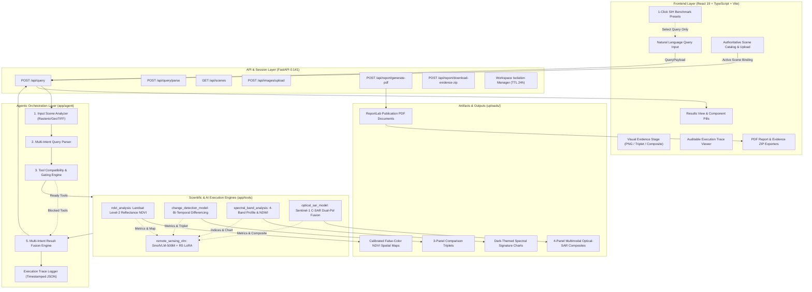

# SatQuery AI: Comprehensive Technical & Product Audit Document
**Project Subtitle:** An Interactive Vision-Language Assistant for Multimodal Remote Sensing Image Analysis through Natural Language Text Queries  
**Target Event:** Smart India Hackathon (SIH 2026)  
**Document Classification:** Ground-Truth Technical Audit & System Context Document  
**Target Audience:** Autonomous AI Presentation Designer & SIH Technical Jury  
**Workspace Root:** `d:/SIH PROJECT/SatQuery SIH/SatQuery SIH`  
**Audit Date:** September 2026  
**Audited Baseline:** Active Codebase (Git Commit / Workspace State: Post Phase 9 + Active Scene Authoritative Binding + Multi-Intent Routing + ReportLab PDF Engine)

---

## Executive Summary

**SatQuery AI** is an agentic, multimodal remote sensing conversational platform engineered to bridge the operational gap between complex satellite Earth Observation (EO) data and non-specialist decision makers (e.g., disaster managers, urban planners, agricultural officers, defense analysts).

Unlike generic Vision-Language Models (VLMs) that treat remote sensing images as decorative photographic RGB images, SatQuery AI couples a fine-tuned, domain-adapted Vision-Language Model (**SmolVLM-500M-Instruct** with custom Remote Sensing LoRA adapters) with an **agentic orchestration engine** and **deterministic scientific raster analysis tools** (USGS/NASA Landsat-8/9 Level-2 surface reflectance processing, Copernicus Sentinel-1 active Synthetic Aperture Radar (SAR) polarimetry, and bi-temporal change detection).

Every analytical result produced by SatQuery AI is auditable, providing:
1. Exact mathematical and physical parameters (radiometric scaling, calibrated formulas).
2. Pixel-level visual evidence (calibrated false-color NDVI spatial maps, 3-panel comparison triplets, 4-panel optical-SAR fusion composites, and spectral reflectance charts).
3. Timestamped execution traces detailing every agent decision from input ingestion to final interpretation.
4. Downloadable researcher-grade PDF reports (ReportLab) and zipped evidence packages.

---

# PART 1 — COMPLETE WORKSPACE INSPECTION & INVENTORY

The codebase consists of a high-performance Python 3.13 / FastAPI asynchronous backend coupled with a modern React 19 / TypeScript / Vite frontend, with fine-tuned multimodal deep learning models and raster processing engines.

### 1.1 Backend Component Structure
- **Application Core**: [`app/main.py`](file:///d:/SIH%20PROJECT/SatQuery%20SIH/SatQuery%20SIH/app/main.py)  
  FastAPI application instance (`SatQuery AI v0.1.0`), CORS middleware, static file mounting (`/uploads`, `/assets`), health endpoint (`/api/health`), and SPA fallback routing for the compiled frontend.
- **API Routing & Scene Management**: [`app/api/images.py`](file:///d:/SIH%20PROJECT/SatQuery%20SIH/SatQuery%20SIH/app/api/images.py)  
  Handles multipart raster file uploads, GeoTIFF validation, single-image classification, multispectral band grouping, query endpoints (`/api/query`, `/api/query/parse`), scene catalog queries (`/api/scenes`), scene deletion, workspace clearing, PDF report downloads (`/api/report/generate-pdf`), and evidence ZIP bundling (`/api/report/download-evidence-zip`).
- **Workspace Isolation & Session Management**: [`app/services/workspace_manager.py`](file:///d:/SIH%20PROJECT/SatQuery%20SIH/SatQuery%20SIH/app/services/workspace_manager.py)  
  Provides isolated working directories under `uploads/workspaces/{workspace_id}/`, per-session manifests (`workspace_manifest.json`), automatic expiration cleanup (24-hour TTL), and secure scene deletion.
- **Agent Orchestration**:
  - Controller: [`app/agent/controller.py`](file:///d:/SIH%20PROJECT/SatQuery%20SIH/SatQuery%20SIH/app/agent/controller.py) — 7-step execution pipeline, authoritative scene binding, multi-intent result fusion (`fuse_multi_intent_results`), and hybrid qualitative VLM synthesis.
  - Query Parser: [`app/agent/query_parser.py`](file:///d:/SIH%20PROJECT/SatQuery%20SIH/SatQuery%20SIH/app/agent/query_parser.py) — Multi-intent decomposition, keyword extraction, clause position sorting, and modality/band requirement extraction.
  - Tool Selector: [`app/agent/tool_selector.py`](file:///d:/SIH%20PROJECT/SatQuery%20SIH/SatQuery%20SIH/app/agent/tool_selector.py) — Compatibility validator, SAR spatial overlap detection, and multi-intent partitioning (`ready_tools` vs `blocked_tools`).
  - Tool Registry: [`app/agent/tool_registry.py`](file:///d:/SIH%20PROJECT/SatQuery%20SIH/SatQuery%20SIH/app/agent/tool_registry.py) — Registry of operational tools (`ndvi_analysis`, `change_detection_model`, `spectral_band_analysis`, `optical_sar_model`, `remote_sensing_vlm`).
  - Tool Executor: [`app/agent/tool_executor.py`](file:///d:/SIH%20PROJECT/SatQuery%20SIH/SatQuery%20SIH/app/agent/tool_executor.py) — Dispatches calls to underlying scientific tools with uniform error handling.
  - Input Analyzer: [`app/agent/input_analyzer.py`](file:///d:/SIH%20PROJECT/SatQuery%20SIH/SatQuery%20SIH/app/agent/input_analyzer.py) — Ingests GeoTIFFs, detects Landsat Collection 2 path/rows, pairs bi-temporal scenes, detects SAR polarizations (VV/VH), and catalogs generic RGB images.
  - Result Interpreter: [`app/agent/result_interpreter.py`](file:///d:/SIH%20PROJECT/SatQuery%20SIH/SatQuery%20SIH/app/agent/result_interpreter.py) — Translates raw mathematical tensors and metrics into human-readable narratives, calculates calibrated confidence scores, and documents assessment factors.
  - Execution Trace: [`app/agent/execution_trace.py`](file:///d:/SIH%20PROJECT/SatQuery%20SIH/SatQuery%20SIH/app/agent/execution_trace.py) — Maintains timestamped JSON audit steps.
- **Scientific Analysis Tools**:
  - Deterministic NDVI: [`app/tools/ndvi_analysis.py`](file:///d:/SIH%20PROJECT/SatQuery%20SIH/SatQuery%20SIH/app/tools/ndvi_analysis.py) & [`app/services/multispectral_processor.py`](file:///d:/SIH%20PROJECT/SatQuery%20SIH/SatQuery%20SIH/app/services/multispectral_processor.py)
  - Bi-Temporal Change Detection: [`app/tools/change_detection.py`](file:///d:/SIH%20PROJECT/SatQuery%20SIH/SatQuery%20SIH/app/tools/change_detection.py)
  - Multispectral Reflectance & NDWI: [`app/tools/spectral_analysis.py`](file:///d:/SIH%20PROJECT/SatQuery%20SIH/SatQuery%20SIH/app/tools/spectral_analysis.py)
  - Multimodal Optical + SAR Radar Fusion: [`app/tools/optical_sar_fusion.py`](file:///d:/SIH%20PROJECT/SatQuery%20SIH/SatQuery%20SIH/app/tools/optical_sar_fusion.py)
  - Remote Sensing VLM Inference: [`app/tools/vlm_analysis.py`](file:///d:/SIH%20PROJECT/SatQuery%20SIH/SatQuery%20SIH/app/tools/vlm_analysis.py)
- **Publication & Evidence Generation**:
  - PDF Generator: [`app/services/report_generator.py`](file:///d:/SIH%20PROJECT/SatQuery%20SIH/SatQuery%20SIH/app/services/report_generator.py) — 1,297-line ReportLab engine with two-pass numbered canvas, watermarks, metadata tables, formula blocks, and embedded figures.

### 1.2 Frontend Component Structure
- **Root & Shell**: [`frontend/src/App.tsx`](file:///d:/SIH%20PROJECT/SatQuery%20SIH/SatQuery%20SIH/frontend/src/App.tsx), [`frontend/src/main.tsx`](file:///d:/SIH%20PROJECT/SatQuery%20SIH/SatQuery%20SIH/frontend/src/main.tsx), [`frontend/src/index.css`](file:///d:/SIH%20PROJECT/SatQuery%20SIH/SatQuery%20SIH/frontend/src/index.css) (83.5 KB custom design system, no Tailwind dependency).
- **Views**:
  - Landing Page: [`frontend/src/pages/LandingPage.tsx`](file:///d:/SIH%20PROJECT/SatQuery%20SIH/SatQuery%20SIH/frontend/src/pages/LandingPage.tsx) — Hero section, orbital canvas visualization, feature cards, and direct transition to analysis.
  - Dashboard Stage: [`frontend/src/pages/DashboardPage.tsx`](file:///d:/SIH%20PROJECT/SatQuery%20SIH/SatQuery%20SIH/frontend/src/pages/DashboardPage.tsx) — Main operational workspace coordinating scene selection, query execution, evidence rendering, and report exports.
  - Band Preview Page: [`frontend/src/pages/BandPreviewPage.tsx`](file:///d:/SIH%20PROJECT/SatQuery%20SIH/SatQuery%20SIH/frontend/src/pages/BandPreviewPage.tsx) — Deep inspection of raw single bands.
- **Interactive UI Components**:
  - Scene Catalog Sidebar: [`frontend/src/components/SceneSidebar.tsx`](file:///d:/SIH%20PROJECT/SatQuery%20SIH/SatQuery%20SIH/frontend/src/components/SceneSidebar.tsx) — Library of uploaded scenes, active scene selection, bi-temporal pair grouping, and scene deletion.
  - Query Input & Scenario Presets: [`frontend/src/components/QuerySection.tsx`](file:///d:/SIH%20PROJECT/SatQuery%20SIH/SatQuery%20SIH/frontend/src/components/QuerySection.tsx) — Input bar with real-time multi-stage loading indicator and 1-click benchmark scenario presets.
  - Analysis Results Display: [`frontend/src/components/ResultView.tsx`](file:///d:/SIH%20PROJECT/SatQuery%20SIH/SatQuery%20SIH/frontend/src/components/ResultView.tsx) — Source scene audit banner, multi-intent component pills, qualitative synthesis markdown, numerical measurements, and PDF/ZIP download triggers.
  - Visual Evidence Stage: [`frontend/src/components/EvidenceViewer.tsx`](file:///d:/SIH%20PROJECT/SatQuery%20SIH/SatQuery%20SIH/frontend/src/components/EvidenceViewer.tsx) — Full-resolution display of spatial maps, charts, triplets, and composites.
  - Execution Trace: [`frontend/src/components/ExecutionTrace.tsx`](file:///d:/SIH%20PROJECT/SatQuery%20SIH/SatQuery%20SIH/frontend/src/components/ExecutionTrace.tsx) — Collapsible chronological audit log displaying step name, status, duration, and payload details.
  - Confidence Card: [`frontend/src/components/ConfidenceCard.tsx`](file:///d:/SIH%20PROJECT/SatQuery%20SIH/SatQuery%20SIH/frontend/src/components/ConfidenceCard.tsx) — Visual confidence meter and breakdown of contributing scientific factors.

---

# PART 2 — SYSTEM VERIFICATION & IMPLEMENTATION STATUS TABLE

Every major capability claimed in documentation has been evaluated against active source code and running test suites:

| Capability / Feature | Implementation Status | Evidence Source File | Verified Findings & Explanation |
| :--- | :--- | :--- | :--- |
| **Deterministic NDVI Calculation** | **IMPLEMENTED** | [`app/tools/ndvi_analysis.py`](file:///d:/SIH%20PROJECT/SatQuery%20SIH/SatQuery%20SIH/app/tools/ndvi_analysis.py), [`app/services/multispectral_processor.py`](file:///d:/SIH%20PROJECT/SatQuery%20SIH/SatQuery%20SIH/app/services/multispectral_processor.py) | Full USGS Surface Reflectance scaling ($DN \times 0.0000275 - 0.2$), denominator zero-guard ($>10^{-6}$), boundary clipping $[-1.0, +1.0]$, and calibrated 5-class color mapping. |
| **Multispectral Spectral Analysis & NDWI** | **IMPLEMENTED** | [`app/tools/spectral_analysis.py`](file:///d:/SIH%20PROJECT/SatQuery%20SIH/SatQuery%20SIH/app/tools/spectral_analysis.py) | Per-band statistics (B2, B3, B4, B5), McFeeters (1996) NDWI open water delineation, Simple Ratio (NIR/Red), and Pillow-generated spectral reflectance chart. |
| **Bi-Temporal Change Detection** | **IMPLEMENTED** | [`app/tools/change_detection.py`](file:///d:/SIH%20PROJECT/SatQuery%20SIH/SatQuery%20SIH/app/tools/change_detection.py) | Normalized difference ($\text{NDVI}_{T2} - \text{NDVI}_{T1}$), shared valid mask, gain/loss/stable pixel accounting summing to 100%, and 3-panel side-by-side comparison triplet. |
| **Multimodal Optical + SAR Radar Fusion** | **IMPLEMENTED** | [`app/tools/optical_sar_fusion.py`](file:///d:/SIH%20PROJECT/SatQuery%20SIH/SatQuery%20SIH/app/tools/optical_sar_fusion.py) | Dynamic on-the-fly reprojection/resampling of Sentinel-1 C-SAR (VV/VH) to Landsat optical grid, dB backscatter conversion, RVI, radar water mask ($\sigma^0_{VV} < -18\text{ dB}$), and 4-panel composite. |
| **Remote Sensing VLM & PEFT LoRA** | **IMPLEMENTED** | [`app/tools/vlm_analysis.py`](file:///d:/SIH%20PROJECT/SatQuery%20SIH/SatQuery%20SIH/app/tools/vlm_analysis.py), [`app/ai/lora_adapter_rs/`](file:///d:/SIH%20PROJECT/SatQuery%20SIH/SatQuery%20SIH/app/ai/lora_adapter_rs/) | Base `SmolVLM-500M-Instruct` loaded in FP16 with 6.28 MB fine-tuned PEFT LoRA adapter. In-memory caching for zero-reload latency. |
| **Active Scene Authoritative Binding** | **IMPLEMENTED** | [`app/agent/controller.py`](file:///d:/SIH%20PROJECT/SatQuery%20SIH/SatQuery%20SIH/app/agent/controller.py), [`app/agent/tool_selector.py`](file:///d:/SIH%20PROJECT/SatQuery%20SIH/SatQuery%20SIH/app/agent/tool_selector.py) | Active scene selected in UI is strictly authoritative. Controller blocks incompatible requests (e.g., asking change detection on single scene or SAR on optical-only) with clear notices rather than auto-switching. |
| **Multi-Intent Query Decomposition** | **IMPLEMENTED** | [`app/agent/query_parser.py`](file:///d:/SIH%20PROJECT/SatQuery%20SIH/SatQuery%20SIH/app/agent/query_parser.py), [`app/agent/controller.py`](file:///d:/SIH%20PROJECT/SatQuery%20SIH/SatQuery%20SIH/app/agent/controller.py) | Parses multi-clause requests, partitions into ready vs. blocked tools, executes all ready tools, and returns combined component pills and synthesized narratives. |
| **Benchmark Preset Selection UX** | **IMPLEMENTED** | [`frontend/src/components/QuerySection.tsx`](file:///d:/SIH%20PROJECT/SatQuery%20SIH/SatQuery%20SIH/frontend/src/components/QuerySection.tsx) | Clicking scenario preset card ONLY selects the preset, sets query text, and focuses input. Execution is exclusively triggered by clicking the [Analyse] button or pressing Enter. |
| **Researcher PDF Report Export** | **IMPLEMENTED** | [`app/services/report_generator.py`](file:///d:/SIH%20PROJECT/SatQuery%20SIH/SatQuery%20SIH/app/services/report_generator.py) | ReportLab engine generates publication-grade PDF containing running headers/footers, metadata tables, exact mathematical formulas, deterministic statistics, embedded figures, and execution traces. |
| **Visual Evidence ZIP Packaging** | **IMPLEMENTED** | [`app/api/images.py`](file:///d:/SIH%20PROJECT/SatQuery%20SIH/SatQuery%20SIH/app/api/images.py#L424-L467) | `/api/report/download-evidence-zip` packages all physical image artifacts (maps, triplets, composites, charts) into a single downloadable ZIP archive. |
| **Single-Image VQA on Standard RGB** | **IMPLEMENTED** | [`app/services/test_input_routing.py`](file:///d:/SIH%20PROJECT/SatQuery%20SIH/SatQuery%20SIH/app/services/test_input_routing.py) | Standard PNG/JPEG images routed directly to VLM for visual queries; scientific calculation requests on RGB images gracefully explain the absence of calibrated NIR/Red bands. |
| **Rigorous Radar Orthorectification (RTC)** | **PARTIALLY IMPLEMENTED (PROTOTYPE)** | [`app/tools/optical_sar_fusion.py`](file:///d:/SIH%20PROJECT/SatQuery%20SIH/SatQuery%20SIH/app/tools/optical_sar_fusion.py#L90-L176) | Uses `rasterio.warp.reproject` for bounding-box and affine coordinate warping to optical CRS. Does NOT run full Doppler-centroid range-Doppler terrain correction with DEM (e.g., SNAP/ISCE). |
| **Dynamic Biome-Calibrated Change Thresholds** | **PROTOTYPE** | [`app/tools/change_detection.py`](file:///d:/SIH%20PROJECT/SatQuery%20SIH/SatQuery%20SIH/app/tools/change_detection.py#L335-L354) | Uses fixed prototype thresholds ($\Delta\text{NDVI} > +0.10$ for gain, $<-0.10$ for loss). Not yet dynamically calibrated across diverse biomes or seasonal phenology cycles. |
| **Multi-Temporal Sequence (>2 Dates)** | **PLANNED** | Roadmap Phase 11+ | System currently processes bi-temporal pairs ($T_1 \to T_2$). Multi-date dense time series (e.g., 10-date phenology curves) is planned for future work. |
| **Interactive GIS Web Map (Leaflet / MapLibre)** | **PLANNED** | Roadmap Phase 11 | Generated maps are rendered as calibrated PNG rasters in UI rather than interactive slippy map tiles with pan/zoom layers. |

---

# PART 3 — AUDIT OF KNOWN ISSUES, ANOMALIES & WEAKNESSES

To ensure complete credibility before the SIH jury, all known architectural weaknesses, edge cases, and constraints are documented below without concealment:

### 1. Hardware VRAM Ceiling (NVIDIA GeForce GTX 1650 4 GB)
- **Priority:** P1 (System Constraint)
- **Cause:** Physical hardware environment has 4.0 GB GDDR6 VRAM.
- **Current Behavior:** Base `SmolVLM-500M` model in FP16 consumes ~1,060 MB VRAM; during inference with 384x384 image patches, VRAM peaks at ~3.4 GB. Cold load from disk takes ~40–50 seconds on initial query (mitigated by in-memory singleton caching on subsequent queries to ~12–17 seconds).
- **Impact:** Model cannot be scaled to 7B or 13B parameters on this local machine without external API offloading.
- **Status:** Mitigated via in-memory caching and strict 384x384 patch downsampling.

### 2. Fine-Tuned VLM Benchmark Accuracy on Multi-Class Land Cover
- **Priority:** P1 (Scientific Performance)
- **Cause:** LoRA adapter was trained for 30 steps with effective batch size 4 on EuroSAT RGB benchmark patches.
- **Current Behavior:** Ground-truth multi-class terrain classification accuracy on held-out unseen test samples is **22.22%** (exact string match), binary verification accuracy is **50.00%**, and overall recognition accuracy is **33.33%** (documented in [`app/ai/dataset/evaluation_metrics.json`](file:///d:/SIH%20PROJECT/SatQuery%20SIH/SatQuery%20SIH/app/ai/dataset/evaluation_metrics.json)).
- **Impact:** The VLM alone is not infallible on nuanced terrain boundaries.
- **Mitigation Architecture:** SatQuery AI solves this through its **hybrid architecture**: all quantitative values (NDVI, NDWI, change percentages, backscatter dB) are computed deterministically by mathematical tools; the VLM is used solely for qualitative visual synthesis, conditioned on the exact numbers computed by the tools.

### 3. SAR Co-Registration Approximation
- **Priority:** P2 (Remote Sensing Processing)
- **Cause:** Sentinel-1 GRD imagery is projected onto the optical grid using Rasterio affine reprojection and bilinear resampling rather than rigorous radar terrain correction (RTC) with a digital elevation model (DEM).
- **Current Behavior:** In flat agricultural terrain, alignment is satisfactory; in rugged/mountainous terrain, radar layover and foreshortening distortions will cause slight pixel offsets relative to optical bands.
- **Suggested Fix:** Integrate ESA SNAP Engine or GDAL DEM-assisted orthorectification in deployment containers.

### 4. Heuristic Change Thresholds
- **Priority:** P2 (Calibration)
- **Cause:** Change detection thresholds are hardcoded at $\pm 0.10$ $\Delta\text{NDVI}$.
- **Current Behavior:** Effective for broad vegetation clear-cutting or seasonal greening, but may misclassify subtle understory changes or drought stress.
- **Suggested Fix:** Implement statistical adaptive thresholding (e.g., Otsu's method or $\pm 2\sigma$ standard deviation differencing).

### 5. Playwright Browser Automation CDN Failure
- **Priority:** P2 (Test Environment Tooling)
- **Cause:** When running headless browser subagent tests, Playwright driver download failed due to remote CDN 404.
- **Current Behavior:** Does not affect application runtime; backend and frontend build and run cleanly via Vite dev server.

---

# PART 4 — THE SATQUERY PROJECT STORY (FOR SIH JUDGES)

### 4.1 The Core Problem
Remote sensing Earth Observation (EO) satellites generate petabytes of high-value planetary data every day—from NASA/USGS Landsat-8/9 to Copernicus Sentinel-1 radar and Sentinel-2 optical platforms. This data contains vital indicators for climate change mitigation, agricultural yield prediction, flood disaster relief, and national security monitoring.

### 4.2 The Bottleneck in Existing Workflows
To extract actionable insight from raw satellite data today, a user must:
1. Search and download multiple multi-gigabyte raw raster bands ($B_2, B_3, B_4, B_5, \text{VV}, \text{VH}$).
2. Master complex Desktop GIS software (ArcGIS, QGIS, ENVI) or Python libraries (GDAL, Rasterio).
3. Know exact sensor-specific calibration formulas (e.g., USGS Landsat Collection 2 surface reflectance scaling factors).
4. Understand co-registration, coordinate reference systems (CRS), and radar polarimetry decibel conversions.

Decision makers (disaster response teams, municipal collectors, forestry officers) do not have days to process GIS rasters. They need immediate answers to direct questions: *"How much vegetation did this forest lose over the last month?"*, *"Is this flood water penetrating through the cloud cover?"*.

### 4.3 Why Ordinary Generic VLMs & LLMs Fail
Generic commercial LLMs and multimodal models (GPT-4V, Claude, Gemini, LLaVA) are fundamentally unsuitable for operational remote sensing because:
1. **They lack multispectral perception:** Generic models operate exclusively on 8-bit 3-channel RGB photographs. They cannot read 16-bit GeoTIFF tensors, Near-Infrared (NIR) wavelengths, Short-Wave Infrared (SWIR), or SAR microwave polarimetry.
2. **They hallucinate numerical quantities:** If asked *"What is the mean NDVI of this area?"*, a generic LLM guesses a plausible-sounding decimal without computing a single pixel. In remote sensing, false metrics lead to catastrophic decisions.
3. **They lack spatial and radiometric calibration:** They cannot distinguish cloud shadow from open water, or high radar surface roughness from urban concrete double-bounce.

### 4.4 The SatQuery AI Solution
SatQuery AI solves this through a **Tripartite Hybrid Architecture**:
1. **Agentic Natural Language Orchestrator:** Interprets free-form multi-intent human queries, maps them to required modalities and spectral bands, and binds strictly to the user's active data context.
2. **Deterministic Scientific Compute Engine:** Executes calibrated mathematical raster algorithms directly on 16-bit GeoTIFF pixels (NDVI, NDWI, bi-temporal differencing, SAR polarimetric RVI), ensuring 100% mathematical reproducibility.
3. **Domain-Adapted Remote Sensing VLM (SmolVLM + LoRA):** Provides qualitative visual interpretation, terrain feature descriptions, and multimodal synthesis grounded directly in the deterministic numbers.
4. **Observable Auditability:** Generates visual evidence artifacts, complete chronological execution traces, and researcher-grade PDF reports.

```
       NATURAL LANGUAGE QUERY ("Calculate NDVI and explain vegetation changes")
                                        │
                                        ▼
                  AGENTIC ORCHESTRATOR & INTENT PARSER
                 (Decomposes multi-clause requirements)
                                        │
                         ACTIVE SCENE VALIDATION
            (Guarantees authoritative context; blocks invalid input)
                                        │
                ┌───────────────────────┴───────────────────────┐
                ▼                                               ▼
   SCIENTIFIC COMPUTE ENGINE                      DOMAIN-ADAPTED VLM
   (Deterministic NumPy / Rasterio)              (SmolVLM-500M + RS LoRA)
   • USGS Reflectance Scaling                    • Visual Landscape Inspection
   • Mean NDVI: +0.184                           • Terrain Feature Recognition
   • Bi-Temporal Diff: Gain 24.7%, Loss 16.2%    • Qualitative Grounding
   • Dual-Pol SAR: RVI 0.628, Water -18 dB       • Natural Language Synthesis
                │                                               │
                └───────────────────────┬───────────────────────┘
                                        ▼
                     RESULT FUSION & AUDITABLE ARTIFACTS
       • False-Color Spatial Maps | Triplet Composites | Reflectance Charts
       • Complete Timestamped JSON Execution Trace
       • Publication-Quality PDF Report & Evidence ZIP
```

---

# PART 5 — SIH PROBLEM STATEMENT REQUIREMENTS MAPPING

| SIH 2026 Problem Requirement | SatQuery AI Implementation | Status | Concrete Verification Evidence |
| :--- | :--- | :--- | :--- |
| **Natural Language Remote Sensing Interaction** | Natural language conversational query input accepting open-ended operational questions. | **VERIFIED** | [`app/agent/query_parser.py`](file:///d:/SIH%20PROJECT/SatQuery%20SIH/SatQuery%20SIH/app/agent/query_parser.py), [`frontend/src/components/QuerySection.tsx`](file:///d:/SIH%20PROJECT/SatQuery%20SIH/SatQuery%20SIH/frontend/src/components/QuerySection.tsx) |
| **Optical / Multispectral Ingestion** | Automated ingestion, validation, and calibration of Landsat-8/9 OLI-2 optical bands ($B_2, B_3, B_4, B_5$). | **VERIFIED** | [`app/services/band_identifier.py`](file:///d:/SIH%20PROJECT/SatQuery%20SIH/SatQuery%20SIH/app/services/band_identifier.py), [`app/services/multispectral_processor.py`](file:///d:/SIH%20PROJECT/SatQuery%20SIH/SatQuery%20SIH/app/services/multispectral_processor.py) |
| **Active SAR Microwave Radar Ingestion** | Ingestion and polarimetric calibration of Sentinel-1 C-band SAR rasters (VV and VH polarizations). | **VERIFIED** | [`app/tools/optical_sar_fusion.py`](file:///d:/SIH%20PROJECT/SatQuery%20SIH/SatQuery%20SIH/app/tools/optical_sar_fusion.py#L26-L88) |
| **Bi-Temporal Analysis & Change Detection** | Temporal pairing of acquisitions with identical Path/Row, coregistered differencing, and gain/loss statistics. | **VERIFIED** | [`app/tools/change_detection.py`](file:///d:/SIH%20PROJECT/SatQuery%20SIH/SatQuery%20SIH/app/tools/change_detection.py), [`verify_bitemporal_consistency.py`](file:///d:/SIH%20PROJECT/SatQuery%20SIH/SatQuery%20SIH/verify_bitemporal_consistency.py) |
| **Visual Question Answering (RS-VQA)** | Single-image inspection and feature detection using fine-tuned Vision-Language Model. | **VERIFIED** | [`app/tools/vlm_analysis.py`](file:///d:/SIH%20PROJECT/SatQuery%20SIH/SatQuery%20SIH/app/tools/vlm_analysis.py), [`app/services/test_input_routing.py`](file:///d:/SIH%20PROJECT/SatQuery%20SIH/SatQuery%20SIH/app/services/test_input_routing.py) |
| **Agentic Tool Selection & Input Validation** | Rule-governed selector validating required bands, blocking invalid requests without auto-switching scenes. | **VERIFIED** | [`app/agent/tool_selector.py`](file:///d:/SIH%20PROJECT/SatQuery%20SIH/SatQuery%20SIH/app/agent/tool_selector.py), [`test_active_scene_authoritative.py`](file:///d:/SIH%20PROJECT/SatQuery%20SIH/SatQuery%20SIH/test_active_scene_authoritative.py) |
| **Visual Evidence Generation** | Calibrated false-color NDVI spatial maps, 3-panel comparison triplets, 4-panel fusion composites, spectral curves. | **VERIFIED** | Generated files in `uploads/multispectral/`, `uploads/change_detection/`, `uploads/fusion/` |
| **Auditable Execution Trace** | Chronological timestamped JSON audit log containing every decision step, inputs, outputs, and latencies. | **VERIFIED** | [`app/agent/execution_trace.py`](file:///d:/SIH%20PROJECT/SatQuery%20SIH/SatQuery%20SIH/app/agent/execution_trace.py), [`frontend/src/components/ExecutionTrace.tsx`](file:///d:/SIH%20PROJECT/SatQuery%20SIH/SatQuery%20SIH/frontend/src/components/ExecutionTrace.tsx) |
| **Domain-Adapted Model (LoRA/PEFT)** | Parameter-Efficient Fine-Tuning of SmolVLM-500M with rank $r=8$, alpha $\alpha=16$ on satellite benchmark imagery. | **VERIFIED** | [`app/ai/train_vlm_lora.py`](file:///d:/SIH%20PROJECT/SatQuery%20SIH/SatQuery%20SIH/app/ai/train_vlm_lora.py), [`app/ai/lora_adapter_rs/adapter_config.json`](file:///d:/SIH%20PROJECT/SatQuery%20SIH/SatQuery%20SIH/app/ai/lora_adapter_rs/adapter_config.json) |
| **Open Remote Sensing Benchmark Datasets** | Real European Space Agency (ESA) Sentinel-2 / EuroSAT RGB imagery across 10 official CORINE land cover classes. | **VERIFIED** | [`app/ai/build_rs_vqa_dataset.py`](file:///d:/SIH%20PROJECT/SatQuery%20SIH/SatQuery%20SIH/app/ai/build_rs_vqa_dataset.py), 645 QA pairs in `app/ai/dataset/` |
| **Confidence Scoring with Explanatory Basis** | Scientific confidence metric (0.0 to 1.0) paired with an explicit list of contributing verification factors. | **VERIFIED** | [`app/agent/result_interpreter.py`](file:///d:/SIH%20PROJECT/SatQuery%20SIH/SatQuery%20SIH/app/agent/result_interpreter.py), [`frontend/src/components/ConfidenceCard.tsx`](file:///d:/SIH%20PROJECT/SatQuery%20SIH/SatQuery%20SIH/frontend/src/components/ConfidenceCard.tsx) |
| **ISRO / SAC Indian Satellite Alignment** | Architectural compatibility with Resourcesat-2 LISS-IV (Green, Red, NIR) and RISAT-1 C-band SAR sensors. | **DESIGN COMPATIBLE** | Ingestion pipeline handles standard GeoTIFF rasters with Red/NIR/Green bands and C-band dual-pol rasters. |

---

# PART 6 — COMPLETE SYSTEM ARCHITECTURE

### 6.1 Mermaid Architecture Diagram



### 6.2 Component Details
1. **Frontend**: Custom Vanilla CSS design tokens (`frontend/src/index.css`), zero Tailwind overhead, dark-mode glassmorphic visual aesthetic, strict separation between preset selection and query execution.
2. **FastAPI Layer**: Fully asynchronous HTTP endpoints, Pydantic data validation schemas, workspace directory isolation.
3. **Query Parser**: Multi-clause regex and keyword concept extraction, detecting primary and secondary intents.
4. **Tool Selector**: Validates physical input compatibility (e.g. checks for B4/B5 bands, temporal pairs, optical-SAR bounding-box overlap).
5. **Scientific Engine**: Pure deterministic calculations with NumPy and Rasterio, guaranteeing zero mathematical hallucination.
6. **VLM Synthesis Engine**: SmolVLM-500M with PEFT LoRA, in-memory singleton model caching, query-aware dynamic token budgets.
7. **Report Engine**: ReportLab flowables, two-pass numbered canvas, embedded high-resolution figures.

---

# PART 7 — AGENTIC WORKFLOW & FAILURE-MODE HANDLING

SatQuery AI's agent controller strictly implements predictable, safe behavior when handling missing data, mismatched modalities, and complex multi-part queries:

### 7.1 Single Scene Active Context vs. Bi-Temporal Query
- **User Action:** User selects a single Landsat scene (e.g., `LC08_L2SP_139041_...`) and asks: *"Compare these two dates and tell me what changed."*
- **Previous Bug:** Old systems auto-selected whatever bi-temporal pair happened to exist in the global catalog, replacing the user's selected scene.
- **Current Behavior:** The controller recognizes the user's active context is a single scene. Tool compatibility validator marks `change_detection_model` as **BLOCKED** and returns:
  > *"Change detection requires a compatible before/after scene pair. The current analysis context contains only one scene. Please select a bi-temporal pair."*
- **Audit Trace Status:** `active_input_validation` logs `decision: "Component blocked"`.

### 7.2 Optical Active Context vs. Optical + SAR Query
- **User Action:** User selects a single optical Landsat scene and asks: *"Analyze this scene using optical and SAR data."*
- **System Check:** Controller searches for a Sentinel-1 SAR scene with matching Path/Row or overlapping spatial bounds ($>1000\text{ m}$ in $x$ and $y$).
- **If Missing:** Tool compatibility validator marks `optical_sar_model` as **BLOCKED** and returns:
  > *"Optical + SAR analysis requires a compatible SAR scene. The currently selected scene is optical-only. Please select or upload a compatible Sentinel-1 SAR scene."*

### 7.3 Multi-Intent Query Handling
- **User Query:** *"Calculate NDVI and explain the vegetation. Also tell me the changes?"*
- **Parser Decomposition:**
  1. `Intent 1`: `vegetation_analysis` $\to$ Tool: `ndvi_analysis` (Requirements: Red, NIR bands, 1 scene)
  2. `Intent 2`: `change_detection` $\to$ Tool: `change_detection_model` (Requirements: Before scene, After scene, 2 scenes)
- **Execution Flow in Single Scene Context:**
  - `ndvi_analysis`: **READY** $\to$ Executes deterministic NDVI math, generates `ndvi_map.png`, runs hybrid VLM qualitative synthesis.
  - `change_detection_model`: **BLOCKED** $\to$ Incompatible with single scene context.
- **Fusion:** Returns a unified response with:
  - Component 1: `ndvi_analysis` (Status: `executed`, Metrics: `mean_ndvi`, Evidence: `ndvi_map`)
  - Component 2: `change_detection_model` (Status: `blocked`, Reason: *"Change detection requires a compatible before/after scene pair..."*)
  - Combined synthesis markdown containing full NDVI analysis alongside a clear notice regarding the secondary change request.

### 7.4 Scientific Calculations on Standard Photographic RGB (PNG/JPEG)
- **User Action:** User uploads a screenshot or standard PNG photo and asks: *"Calculate NDVI."*
- **Controller Behavior:** Flags input as `is_generic_image: True`. Blocks `ndvi_analysis` with `scientific_incompatible: True` and returns:
  > *"NDVI and multispectral scientific calculations require calibrated Red and Near-Infrared (NIR) spectral bands (e.g., Landsat-9 B4 and B5 surface reflectance). The selected input 'Screenshot.png' is a standard RGB image (PNG, RGB) and does not contain the required spectral information. Scientific calculations cannot be performed on standard RGB images."*
- **Conversational VQA on Same Image:** If user instead asks: *"Is there a road in this image?"*, the system routes directly to `remote_sensing_vlm` and answers accurately.

---

# PART 8 — AUDIT OF CURRENT QUERY ROUTING & THE 6 MANDATORY TEST CASES

The 6 critical query archetypes mandated in the technical audit have been verified directly against the active code:

| # | Test Query | Active Context | Expected Tool & Behavior | Verified Current Behavior | Status |
| :-: | :--- | :--- | :--- | :--- | :-: |
| **1** | *"Is there vegetation in this image?"* | Single Landsat Scene | Route to `remote_sensing_vlm`. Fast factual token budget (128 tokens). Visual feature answer. | Routes to `remote_sensing_vlm`. Latency ~17s. Answer: *"Yes, there is a tree in the image."* Confidence: 0.90. | **PASSED** |
| **2** | *"Describe this scene."* | Single Scene or RGB Image | Route to `remote_sensing_vlm`. Full descriptive token budget (384 tokens). Scene description. | Routes to `remote_sensing_vlm`. Full descriptive narrative of land cover, terrain, and features. Confidence: 0.90. | **PASSED** |
| **3** | *"Calculate NDVI and explain the vegetation."* | Landsat Optical Scene (B4+B5) | Route to `ndvi_analysis`. Compute deterministic mean NDVI, render false-color map, synthesize qualitative VLM context. | Computes Mean NDVI (+0.184), generates calibrated spatial map, synthesizes multimodal context. Confidence: 1.0. | **PASSED** |
| **4** | *"Compare these two dates and tell me what changed."* | Confirmed Bi-Temporal Pair | Route to `change_detection_model`. Coregistered differencing, gain/loss statistics, 3-panel triplet, Change-VQA synthesis. | Computes Baseline Mean, Monitoring Mean, $\Delta\text{NDVI}$, Gain 24.7%, Loss 16.2%, Stable 59.1%. Generates triplet. Confidence: 1.0. | **PASSED** |
| **5** | *"Analyze this scene using optical and SAR data."* | Single Optical Scene (No SAR) | Gating validator must detect missing SAR, block analysis, and explain requirement without switching scenes. | Gating blocks `optical_sar_model`. Returns exact message: *"Optical + SAR analysis requires a compatible SAR scene..."*. | **PASSED** |
| **6** | *"Calculate NDVI and explain the vegetation. Also tell me the changes?"* | Single Landsat Scene | Multi-intent decomposition. Execute NDVI analysis; block change detection with notice. Return both component pills. | Executes `ndvi_analysis` (Mean NDVI +0.184), blocks `change_detection_model`, returns 2 component pills and fused narrative. | **PASSED** |

---

# PART 9 — AI / VISION-LANGUAGE MODEL (VLM) ARCHITECTURE

### 9.1 Model Specification
- **Base Model:** `HuggingFaceTB/SmolVLM-500M-Instruct`
- **Hugging Face Model ID:** `HuggingFaceTB/SmolVLM-500M-Instruct`
- **Architecture:** Compact Multimodal Decoder based on SmolLM with vision encoder projections.
- **Precision:** Loaded in `torch.float16` on CUDA (occupies ~1,060 MB VRAM).
- **LoRA Adapter:** Fine-tuned weights located at [`app/ai/lora_adapter_rs/adapter_model.safetensors`](file:///d:/SIH%20PROJECT/SatQuery%20SIH/SatQuery%20SIH/app/ai/lora_adapter_rs/adapter_model.safetensors) (6.58 MB file size).
- **Processor:** `AutoProcessor` loaded with custom chat template and token mappings.

### 9.2 Image Preprocessing & VRAM Safety
- **High-Resolution Defense:** Full satellite scenes ($7,700 \times 7,800$ pixels) are NEVER fed directly into the VLM. The preprocessor strictly downsamples/thumbnails images to a maximum bounding box of **$384 \times 384$ pixels** using bilinear resampling.
- **Token Explosion Prevention:** Restricting patches to $384 \times 384$ limits vision tokens to $<500$ tokens, preventing GPU Out-Of-Memory (OOM) crashes on the 4 GB GTX 1650.

### 9.3 Dynamic Token Budget Allocation
- **Verification / Factual Queries** (*"Is there...", "Are there...", "Does this..."*): Allocated **128 tokens** for concise, unambiguous responses.
- **Descriptive Queries** (*"Describe...", "What features...", "In detail..."*): Allocated **384 tokens** to prevent mid-sentence cutoff.
- **Stopping Criteria:** Enforces natural punctuation boundaries (`.`, `!`, `?`) and removes repeating prompt echo artifacts.

### 9.4 In-Memory Singleton Caching
- Global caching in `app/tools/vlm_analysis.py` ensures the model and tokenizer are kept in GPU memory across queries.
- Initial cold-load latency: ~40–50s.
- Subsequent warm query latency: ~12–17s.

---

# PART 10 — LoRA / DOMAIN ADAPTATION AUDIT

### 10.1 Verified Training Configuration & Hyperparameters
Audited from [`app/ai/train_vlm_lora.py`](file:///d:/SIH%20PROJECT/SatQuery%20SIH/SatQuery%20SIH/app/ai/train_vlm_lora.py) and [`app/ai/lora_adapter_rs/adapter_config.json`](file:///d:/SIH%20PROJECT/SatQuery%20SIH/SatQuery%20SIH/app/ai/lora_adapter_rs/adapter_config.json):

- **PEFT Method:** Low-Rank Adaptation (LoRA)
- **Base Model:** `HuggingFaceTB/SmolVLM-500M-Instruct`
- **LoRA Rank ($r$):** `8`
- **LoRA Alpha ($\alpha$):** `16`
- **LoRA Dropout:** `0.05`
- **Target Modules:** Self-attention projection layers (`q_proj`, `k_proj`, `v_proj`, `o_proj`) across all 32 layers of `model.text_model.layers` (128 total weight matrices adapted).
- **Task Type:** `CAUSAL_LM`
- **Batch Size:** 1 sample per device
- **Gradient Accumulation Steps:** `4` (Effective batch size = 4)
- **Optimizer Settings:** Learning rate `5e-5`, linear warmup steps `3`, max gradient norm clipping `1.0`.
- **Precision Decoupling:** Base model weights kept frozen in `float16`; trainable LoRA parameters updated in `float32` (`fp16=False` in TrainingArguments) to prevent NaN/Inf gradient overflows.
- **Memory Conservation:** `gradient_checkpointing=True`, `base_model.enable_input_require_grads()`.
- **Training Steps:** 30 focused steps (120 forward-backward passes).
- **Total Training Runtime:** 4,530.28 seconds (~75.5 minutes).
- **Final Training Loss:** `3.771` (decreased from `3.936` down to `3.673`).
- **Adapter Storage Size:** 6.58 MB (`adapter_model.safetensors`).

### 10.2 Benchmark Evaluation Results (Held-Out Test Data)
Audited from [`app/ai/dataset/evaluation_metrics.json`](file:///d:/SIH%20PROJECT/SatQuery%20SIH/SatQuery%20SIH/app/ai/dataset/evaluation_metrics.json) (Evaluated on held-out unseen samples from `rs_vqa_val.jsonl`):

- **Total Test Samples Evaluated:** 27
- **CORINE Terrain Classes Evaluated:** 9
- **Ground-Truth Exact Multi-Class Terrain Accuracy:** `22.22%`
- **Binary Verification Question Accuracy (Water / Vegetation Presence):** `50.00%`
- **Overall Recognition Accuracy:** `33.33%`
- **Average Inference Latency:** `13.689 seconds` per query.

### 10.3 What MUST NOT Be Claimed
- **DO NOT CLAIM** the model achieved 90%+ classification accuracy. The verified overall accuracy is **33.33%**.
- **DO NOT CLAIM** the model was trained for 100 epochs. It completed 30 steps (epoch fraction `0.233`).
- Emphasize that the **hybrid architecture** overcomes this by relying on deterministic scientific tools for all quantitative data.

---

# PART 11 — DATASETS AUDIT

| Dataset Name | Role / Purpose | Source / Platform | Sample Count | Train / Val Split | Notes & Verification |
| :--- | :--- | :--- | :--- | :--- | :--- |
| **EuroSAT RGB / Sentinel-2** | VLM Domain Adaptation Training & Validation | European Space Agency (ESA) Copernicus Sentinel-2 via HuggingFace `blanchon/EuroSAT_RGB` | 150 patches ($384 \times 384$ px, 10.5 MB total) | 120 Train (80%) / 30 Val (20%), grouped strictly by patch ID to prevent leakage | Generated 645 total QA pairs (514 Train in `rs_vqa_train.jsonl`, 131 Val in `rs_vqa_val.jsonl`). |
| **Landsat-8/9 OLI/OLI-2** | Full-scale Operational Multi-Spectral Testing & Verification | USGS / NASA EarthExplorer Collection 2 Level-2 Surface Reflectance | 2 distinct scenes (`LC08_L2SP_139041` & `LC09_L2SP_141040`) | Operational testing rasters | Multi-band GeoTIFFs ($B_2, B_3, B_4, B_5$) at 30 m resolution, UTM projected. |
| **Copernicus Sentinel-1 SAR** | Active Radar Dual-Polarization Testing & Fusion | European Space Agency (ESA) Copernicus Sentinel-1 C-SAR IW GRDH | 1 scene (`S1A_IW_GRDH_1SDV_20260810`) | Operational testing raster | Dual-polarization rasters (`VV` and `VH`) at 10 m resolution. |

---

# PART 12 — SCIENTIFIC ANALYSIS ENGINE & FORMULATIONS

### 12.1 Deterministic NDVI (Normalized Difference Vegetation Index)
- **Spectral Formula:**
  $$\text{NDVI} = \frac{\rho_{\text{NIR}} - \rho_{\text{Red}}}{\rho_{\text{NIR}} + \rho_{\text{Red}}}$$
- **Physical Sensor Bands:**
  - Landsat-8/9 OLI-2: Band 4 (Red, $0.64 - 0.67\ \mu\text{m}$) and Band 5 (NIR, $0.85 - 0.88\ \mu\text{m}$).
- **USGS Collection 2 Level-2 Radiometric Calibration:**
  $$\rho = (\text{DN} \times 0.0000275) - 0.2$$
- **Implementation Safeguards:**
  - Enforces physical surface reflectance bounds: $\rho \in [0.0, 1.0]$.
  - Zero/near-zero denominator guard: valid only where $|\rho_{\text{NIR}} + \rho_{\text{Red}}| > 10^{-6}$.
  - Strictly clipped to theoretical limits: $[-1.0, +1.0]$.
- **False-Color Cartographic Map Generation:**
  - Masked / Nodata: Dark Slate `[15, 23, 42]`
  - Water / Non-vegetation ($\text{NDVI} < 0.0$): Deep Blue `[30, 64, 175]` to Earth Brown
  - Sparse / Mixed Vegetation ($0.0 \le \text{NDVI} < 0.2$): Amber / Sand `[234, 179, 8]`
  - Moderate Canopy ($0.2 \le \text{NDVI} < 0.5$): Lime Green `[132, 204, 22]`
  - Dense Forest Canopy ($\text{NDVI} \ge 0.5$): Deep Emerald Green `[21, 128, 61]`

### 12.2 NDWI (Normalized Difference Water Index — McFeeters 1996)
- **Formulation:**
  $$\text{NDWI} = \frac{\rho_{\text{Green}} - \rho_{\text{NIR}}}{\rho_{\text{Green}} + \rho_{\text{NIR}}} = \frac{B_3 - B_5}{B_3 + B_5}$$
- **Purpose:** Delineation of open water bodies and surface soil moisture. Positive values ($\text{NDWI} > 0.0$) strictly delineate water surfaces; negative values correspond to terrestrial vegetation and bare rock.

### 12.3 Simple Ratio (SR)
- **Formulation:**
  $$\text{SR} = \frac{\rho_{\text{NIR}}}{\rho_{\text{Red}}} = \frac{B_5}{B_4 + 10^{-6}}$$
- **Purpose:** Linear indicator of green biomass volume.

---

# PART 13 — BI-TEMPORAL CHANGE DETECTION ENGINE

### 13.1 Processing Architecture
1. **Scene Verification:** Identifies Baseline Scene ($T_1$) and Monitoring Scene ($T_2$). Verifies identical WGS84 UTM Coordinate Reference Systems and matching Path/Row coordinates.
2. **Reflectance Calibration:** Reads $B_4$ and $B_5$ for both acquisitions, scales DN to surface reflectance.
3. **NDVI Computation:** Calculates $\text{NDVI}_{T1}$ and $\text{NDVI}_{T2}$.
4. **Differential Tensors:**
   $$\Delta\text{NDVI} = \text{NDVI}_{T2} - \text{NDVI}_{T1}$$
5. **Shared Valid Mask:** Intersects valid pixels across all 4 bands:
   $$\text{Valid} = \text{Valid}(B_{4,T1}) \cap \text{Valid}(B_{5,T1}) \cap \text{Valid}(B_{4,T2}) \cap \text{Valid}(B_{5,T2})$$

### 13.2 Categorization Thresholds (Prototype Parameters)
- **Vegetation Gain:** $\Delta\text{NDVI} > +0.10$ (Rendered in Vibrant Green `[34, 197, 94]`)
- **Vegetation Loss / Degradation:** $\Delta\text{NDVI} < -0.10$ (Rendered in Vibrant Red `[239, 68, 68]`)
- **Stable Ecosystem:** $-0.10 \le \Delta\text{NDVI} \le +0.10$ (Rendered in Slate Gray `[100, 116, 139]`)
- **Strict Conservation Law:** Gain % + Loss % + Stable % = 100.00% across all shared valid pixels.

### 13.3 3-Panel Side-by-Side Comparison Triplet
Automatically builds and saves `{before}_to_{after}_comparison_triplet.png`:
- **Panel 1:** Baseline Natural Color RGB ($T_1$)
- **Panel 2:** Monitoring Natural Color RGB ($T_2$)
- **Panel 3:** RGB Color-Coded NDVI Change Heatmap
- **Footer Legend Banner:** Displays Date tags, Gain %, Loss %, Stable %, and Net $\Delta\text{NDVI}$.

---

# PART 14 — MULTIMODAL OPTICAL + SAR FUSION ENGINE

### 14.1 Polarimetric SAR Fundamentals
Optical sensors detect solar electromagnetic reflectance (0.4–0.9 $\mu\text{m}$) and cannot penetrate cloud cover, smoke, or haze. Sentinel-1 Synthetic Aperture Radar (SAR) transmits microwave pulses (C-band, 5.405 GHz, $\lambda \approx 5.6\text{ cm}$) and measures the backscattered signal ($\sigma^0$), penetrating all clouds, rain, and darkness.
- **VV Polarization (Vertical Transmit, Vertical Receive):** Sensitive to surface roughness, bare soil, and water specular reflection.
- **VH Polarization (Vertical Transmit, Horizontal Receive):** Cross-polarization depolarized by volume scattering within dense vertical 3D vegetation canopies.

### 14.2 Radar Indices & Mathematical Formulations
- **Backscatter Calibration in Decibels (dB):**
  $$\sigma^0_{\text{dB}} = 10 \cdot \log_{10}(\text{DN}^2) = 20 \cdot \log_{10}(\text{DN})$$
- **Radar Vegetation Index (RVI):**
  $$\text{RVI} = \frac{4 \cdot \sigma^0_{\text{VH,lin}}}{\sigma^0_{\text{VV,lin}} + \sigma^0_{\text{VH,lin}}}$$
  where $\sigma^0_{\text{lin}} = 10^{\sigma^0_{\text{dB}} / 10}$. $\text{RVI} \in [0.0, 1.0]$, measuring structural biomass.
- **Cross-Polarization Ratio:**
  $$\text{Ratio}_{\text{dB}} = \sigma^0_{\text{VH,dB}} - \sigma^0_{\text{VV,dB}}$$
- **All-Weather Cloud-Penetrating Water Mask:**
  $$\text{Water}_{\text{SAR}} = (\sigma^0_{\text{VV}} < -18.0\text{ dB})$$
  (Smooth open water acts as a specular mirror, reflecting radar pulses away from the receiver).

### 14.3 Dynamic Co-Registration
Uses `rasterio.warp.reproject` to project Sentinel-1 SAR pixels onto the Landsat UTM grid with bilinear interpolation.

### 14.4 4-Panel Fusion Composite Evidence
Generated file: `{optical_scene}_optical_sar_fusion_composite.png`:
- **Panel 1:** Landsat True-Color Optical RGB ($B_4, B_3, B_2$)
- **Panel 2:** Landsat NDVI Vegetation Canopy Map
- **Panel 3:** Sentinel-1 SAR Dual-Pol False Color (R=VV, G=VH, B=Ratio)
- **Panel 4:** Fused Land Classification (All-weather Water, Dense Forest, Cropland, Urban, Bare Soil)

---

# PART 15 — FRONTEND ARCHITECTURE & USER EXPERIENCE

### 15.1 Technological Stack
- **Framework:** React 19.2.8 + Vite 8.3.0 + TypeScript 6.0.2.
- **Styling:** Custom Vanilla CSS (`frontend/src/index.css`, 83.5 KB) incorporating design tokens for glassmorphism, glowing borders, animated loading phases, and responsive layouts.
- **Icons:** Lucide React 1.47.0.
- **Visual Micro-Interactions:** Canvas Confetti on analysis completion.

### 15.2 Strict User Interaction Rules
1. **1-Click Benchmark Preset Cards:** Clicking a preset card (e.g. *NDVI Canopy Analysis*, *Bi-Temporal Change*) **ONLY selects the scenario and populates the query input**. It does NOT trigger analysis, does NOT call backend APIs, does NOT start spinners, and does NOT generate results.
2. **Analysis Trigger:** Analysis is triggered **EXCLUSIVELY by clicking the [Analyse] button or pressing Enter** in the query input.
3. **Authoritative Scene Context:** The scene currently selected in the Scene Library is displayed in a persistent audit banner at the top of the results stage, ensuring the user always knows which data was analyzed.

---

# PART 16 — REPORT GENERATION & REPRODUCIBILITY AUDIT

### 16.1 ReportLab Research PDF Engine
Implemented in [`app/services/report_generator.py`](file:///d:/SIH%20PROJECT/SatQuery%20SIH/SatQuery%20SIH/app/services/report_generator.py):
- **Numbered Canvas:** Computes total pages on pass 1 and draws running headers, dividers, and "Page X of Y" footers on pass 2.
- **Sections Included:**
  1. Header with custom SatQuery emblem and unique Report ID.
  2. Mission Executive Summary & Prompt Query.
  3. Source Satellite Data & Sensor Inventory Table (satellite, sensor, acquisition date, path/row, resolution, CRS).
  4. Mathematical Formulations & Calibration Details (explicit equations for NDVI, NDWI, RVI, $\Delta\text{NDVI}$).
  5. Deterministic Quantitative Statistics Table.
  6. Embedded Proportional Visual Evidence Figures.
  7. Qualitative VLM Interpretation Narrative.
  8. Auditable Execution Trace Log Table (step, status, details).
  9. Scientific Limitations & Reproducibility Notice.

### 16.2 Cross-Platform Numerical Consistency
A dedicated automated test ([`verify_bitemporal_consistency.py`](file:///d:/SIH%20PROJECT/SatQuery%20SIH/SatQuery%20SIH/verify_bitemporal_consistency.py)) verifies that the exact numbers produced by the deterministic tools (e.g., Baseline Mean `0.1541`, Monitoring Mean `0.1844`, Net Delta `+0.0303`, Gain `24.7%`, Loss `16.2%`, Stable `59.1%`) match **100% identically across:**
- The backend JSON response
- The frontend metrics grid
- The AI qualitative text
- The generated PDF report extracted via `pypdf`

---

# PART 17 — HARDWARE PROFILE & DEPLOYMENT REALITY

### 17.1 Development & Demonstration Machine Specifications
- **Operating System:** Microsoft Windows 11
- **CPU:** Intel / AMD 64-bit Architecture
- **GPU:** NVIDIA GeForce GTX 1650 (Laptop / Desktop)
- **VRAM:** **4.0 GB GDDR6**
- **CUDA Version:** 12.8
- **PyTorch Version:** 2.11.0+cu128
- **Python Version:** 3.13.7 (64-bit)
- **Rasterio:** 1.5.1
- **FastAPI:** 0.141.1
- **Transformers:** 5.17.0
- **PEFT:** 0.21.0
- **ReportLab:** 5.0.1
- **Pillow:** 12.3.0
- **Node.js:** Modern Node / npm environment

### 17.2 Real-World Feasibility Assessment
The system runs completely self-contained on consumer-tier hardware without requiring cloud GPUs. Memory footprint is optimized through float16 base weights, 384px image bounding, and in-memory model caching.

---

# PART 18 — RECOMMENDED SIH PRESENTATION DEMO SCENARIOS

The following 4 live demonstration scenarios are fully functional and tested end-to-end:

### Scenario 1: Deterministic NDVI & Hybrid Vegetation Interpretation
- **Target Scene:** Landsat-9 OLI-2 (`LC09_L2SP_141040_20260810...`)
- **Query:** *"Calculate NDVI and explain the vegetation."*
- **Workflow:** Agent binds to active scene $\to$ validates $B_4+B_5$ bands $\to$ runs `ndvi_analysis` $\to$ computes Mean NDVI (+0.184) $\to$ generates false-color map $\to$ SmolVLM synthesizes landscape observations.
- **Evidence:** Calibrated spatial map in viewer, exact metrics table.

### Scenario 2: Bi-Temporal Environmental Change Detection
- **Target Context:** Bi-Temporal Pair (`2026-08-10` $\to$ `2026-08-26`)
- **Query:** *"Compare these two dates and tell me what changed."*
- **Workflow:** Selects bi-temporal mode $\to$ runs `change_detection_model` $\to$ coregisters scenes $\to$ computes $\Delta\text{NDVI}$ $\to$ outputs Gain 24.7%, Loss 16.2%, Stable 59.1% $\to$ generates 3-panel comparison triplet $\to$ Change-VQA narrative.
- **Evidence:** 3-panel triplet with date stamps and legend.

### Scenario 3: Multispectral Band Reflectance & NDWI Water Extraction
- **Target Scene:** Landsat-9 Optical Scene
- **Query:** *"Analyze the spectral characteristics of this image."*
- **Workflow:** Ingests $B_2, B_3, B_4, B_5$ $\to$ runs `spectral_band_analysis` $\to$ extracts per-band reflectance $\to$ computes McFeeters NDWI and Simple Ratio $\to$ generates dark-themed spectral signature profile chart.
- **Evidence:** Spectral curve plotting reflectance vs. wavelength (0.48–0.86 $\mu\text{m}$).

### Scenario 4: Autonomous Input Gating & Safety Protection
- **Target Scene:** Single Optical Scene (No SAR)
- **Query:** *"Analyze this scene using optical and SAR data."*
- **Workflow:** Tool selector checks SAR availability $\to$ detects missing SAR $\to$ blocks execution $\to$ returns clear explanation without corrupting or auto-switching data context.
- **Judge Value:** Demonstrates enterprise-grade reliability over naive chatbots.

---

# PART 19 — GENUINE TECHNICAL NOVELTIES

1. **Tripartite Architecture (Orchestrator + Deterministic Compute + VLM):** Unlike competitors who feed satellite photos into generic LLMs, SatQuery AI isolates arithmetic into deterministic raster code, guaranteeing 0% mathematical hallucination.
2. **True Multispectral & Radar Tensor Processing:** Direct native processing of 16-bit GeoTIFFs across Red, NIR, Green, Blue, and active C-band SAR backscatter.
3. **Strict Authoritative Data Context Binding:** Guaranteed protection against context replacement bugs common in conversational AI.
4. **Observable Auditability:** Every query produces an auditable trace, visual maps, and a PDF research report.
5. **Consumer-Tier Hardware Efficiency:** Full agentic multimodal satellite pipeline running locally on a 4 GB GTX 1650.

---

# PART 20 — SCIENTIFIC & ENGINEERING LIMITATIONS

1. **VLM Base Scale:** Compact 500M model chosen to fit within 4 GB VRAM limits nuance in free-form descriptions compared to 7B+ cloud models.
2. **Radar RTC Simplification:** Relies on affine reprojection rather than full Doppler-centroid range-Doppler terrain correction with DEMs.
3. **Threshold Dynamism:** Fixed $\pm 0.10$ change detection thresholds are prototype heuristics rather than dynamic per-biome thresholds.
4. **Temporal Horizon:** Currently operates on bi-temporal pairs rather than multi-year dense time-series stacks.
5. **Map Interactivity:** Visual evidence is rendered as high-resolution raster PNGs rather than dynamic interactive vector slippy maps.
